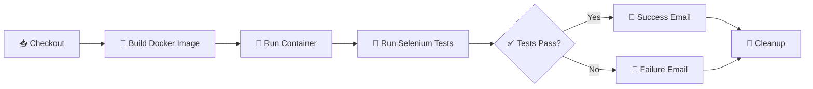

<div align="center">

# 🚀 TDS Assignment 3: DevOps Pipeline

### A Complete CI/CD Pipeline with Flask, Selenium, Jenkins, Docker & AWS


</div>

---

## 📋 Table of Contents

- [Overview](#-overview)
- [Features](#-features)
- [Tech Stack](#-tech-stack)
- [Project Structure](#-project-structure)
- [Getting Started](#-getting-started)
- [Application Routes](#-application-routes)
- [CI/CD Pipeline](#-cicd-pipeline)
- [Automated Testing](#-automated-testing)
- [Docker Setup](#-docker-setup)
- [AWS Deployment](#-aws-deployment)


---

## 🎯 Overview

This project demonstrates a **production-ready DevOps pipeline** for an inventory management system. It showcases modern development practices including containerization, continuous integration, automated testing, and cloud deployment. 

<div align="center">

```
┌─────────────┐     ┌─────────────┐     ┌─────────────┐     ┌─────────────┐
│   GitHub    │────▶│   Jenkins   │────▶│   Docker    │────▶│    AWS      │
│  (Source)   │     │  (CI/CD)    │     │  (Build)    │     │  (Deploy)   │
└─────────────┘     └─────────────┘     └─────────────┘     └─────────────┘
                           │
                           ▼
                    ┌─────────────┐
                    │  Selenium   │
                    │  (Testing)  │
                    └─────────────┘
```

</div>

---

## ✨ Features

| Feature | Description |
|---------|-------------|
| 🔐 **User Authentication** | Secure registration, login, and logout functionality |
| 📦 **Inventory Management** | Full CRUD operations for inventory items |
| 🔍 **Search Functionality** | Search items by name with regex support |
| 👤 **Profile Management** | Update user profile and email |
| 🎨 **Responsive UI** | Bootstrap-powered modern interface |
| 🧪 **Automated Testing** | 10 Selenium test cases for comprehensive coverage |
| 🐳 **Containerized** | Docker support for consistent environments |
| 🔄 **CI/CD Pipeline** | Automated builds and deployments with Jenkins |

---

## 🛠 Tech Stack

<table>
<tr>
<td align="center" width="150">

### Backend


Flask + PyMongo

</td>
<td align="center" width="150">

### Database


MongoDB Atlas

</td>
<td align="center" width="150">

### Frontend


Responsive UI

</td>
<td align="center" width="150">

### Testing


Automated Tests

</td>
</tr>
<tr>
<td align="center" width="150">

### CI/CD


Pipeline Automation

</td>
<td align="center" width="150">

### Container


Containerization

</td>
<td align="center" width="150">

### Cloud


EC2 Deployment

</td>
<td align="center" width="150">

### Version Control


Source Control

</td>
</tr>
</table>

---

## 📁 Project Structure

```
TDS_A3/
├── 📄 app.py                    # Main Flask application
├── 🐳 Dockerfile                # Docker container configuration
├── 🔧 Jenkinsfile               # CI/CD pipeline definition
├── 📋 requirements.txt          # Python dependencies
├── 🧪 mongo_test.py             # MongoDB connection test
├── 🧪 test_mongo_connection.py  # Connection verification
├── 📁 templates/                # HTML templates
│   ├── base.html                # Base template with navigation
│   ├── home.html                # Dashboard/inventory list
│   ├── login. html               # User login page
│   ├── register.html            # User registration page
│   ├── add_item.html            # Add new inventory item
│   ├── edit_item.html           # Edit existing item
│   ├── profile.html             # User profile management
│   └── search_results.html      # Search results display
└── 📁 tests/
    └── test_selenium.py         # Selenium automated tests
```

---

## 🚀 Getting Started

### Prerequisites

- Python 3.9+
- Chrome Browser
- Docker (optional)
- Git

### Quick Start

```bash
# 1️⃣ Clone the repository
git clone https://github.com/ranazaeem-1/TDS_A3.git
cd TDS_A3

# 2️⃣ Create virtual environment
python -m venv venv
source venv/bin/activate  # Windows: venv\Scripts\activate

# 3️⃣ Install dependencies
pip install -r requirements.txt

# 4️⃣ Run the application
python app.py
```

🌐 **Access the app at:** `http://localhost:5000`

---

## 🗺 Application Routes

| Route | Method | Description | Auth Required |
|-------|--------|-------------|:-------------:|
| `/` | GET | Home page / Inventory dashboard | ✅ |
| `/login` | GET, POST | User login | ❌ |
| `/register` | GET, POST | New user registration | ❌ |
| `/logout` | GET | User logout | ✅ |
| `/add_item` | GET, POST | Add new inventory item | ✅ |
| `/edit_item/<id>` | GET, POST | Edit existing item | ✅ |
| `/delete_item/<id>` | GET | Delete an item | ✅ |
| `/search` | GET, POST | Search inventory | ✅ |
| `/profile` | GET, POST | User profile management | ✅ |

---

## 🔄 CI/CD Pipeline

The Jenkins pipeline automates the entire build, test, and notification process:



### Pipeline Stages

| Stage | Description |
|-------|-------------|
| **Checkout** | Cleans workspace and pulls latest code from GitHub |
| **Build Docker Image** | Creates container image with all dependencies |
| **Run App Container** | Starts the application in a Docker container |
| **Run Selenium Tests** | Executes all 10 automated test cases |
| **Post Actions** | Sends email notifications and cleans up containers |

---

## 🧪 Automated Testing

The project includes **10 comprehensive Selenium test cases**:

| # | Test Case | Description |
|---|-----------|-------------|
| 1 | 🏠 Home Redirect | Verifies unauthenticated users are redirected to login |
| 2 | 📝 User Registration | Tests new user signup flow |
| 3 | ❌ Login Failure | Validates error handling for wrong credentials |
| 4 | ✅ Successful Login | Confirms login with correct credentials |
| 5 | ➕ Add Item | Tests adding new inventory items |
| 6 | ✏️ Edit Item | Verifies item modification functionality |
| 7 | 🔍 Search | Tests search functionality |
| 8 | 🗑️ Delete Item | Confirms item deletion |
| 9 | 👤 Update Profile | Tests profile update feature |
| 10 | 🚪 Logout | Verifies logout functionality |

### Running Tests Locally

```bash
pytest -v tests/test_selenium.py
```

---

## 🐳 Docker Setup

### Build & Run

```bash
# Build the Docker image
docker build -t tds_flask_app . 

# Run the container
docker run -p 5000:5000 tds_flask_app
```

### Docker Configuration

The Dockerfile includes:
- ✅ Python 3.9 slim base image
- ✅ Chrome & ChromeDriver for Selenium tests
- ✅ All required system dependencies
- ✅ MongoDB Atlas connection setup

---

## ☁️ AWS Deployment

### EC2 Instance Setup

1. **Launch Instance**:  Ubuntu t2.micro
2. **Security Groups**:  Open ports 22, 5000, 8080

### Required Installations

```bash
# Update system
sudo apt update && sudo apt upgrade -y

# Install Java (for Jenkins)
sudo apt install openjdk-11-jdk -y

# Install Docker
sudo apt install docker.io -y
sudo usermod -aG docker jenkins

# Install Jenkins
wget -q -O - https://pkg.jenkins.io/debian-stable/jenkins.io.key | sudo apt-key add -
sudo sh -c 'echo deb https://pkg.jenkins.io/debian-stable binary/ > /etc/apt/sources. list.d/jenkins.list'
sudo apt update && sudo apt install jenkins -y
```

### GitHub Webhook Configuration

```
Payload URL: http://<EC2-IP>:8080/github-webhook/
Content Type: application/json
Events: Push events
```

---


---

<div align="center">

### 🌟 Made with ❤️ for TDS Assignment 3

**[View Repository](https://github.com/ranazaeem-1/TDS_A3)** • **[Report Issues](https://github.com/ranazaeem-1/TDS_A3/issues)**

</div>
